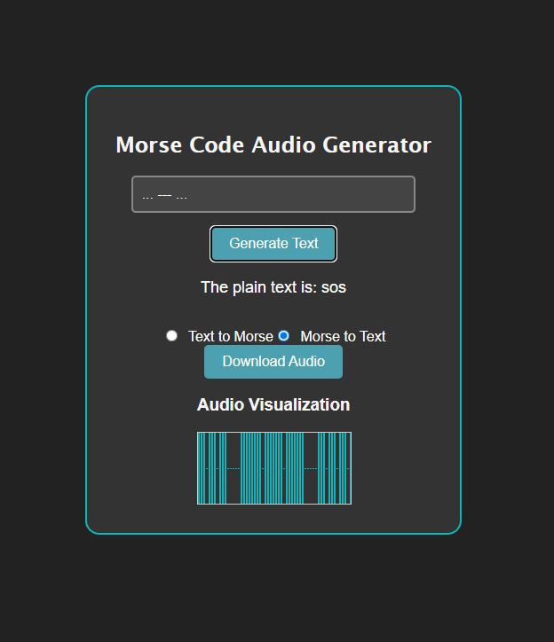

# Morse Code Audio Generator

This project allows you to convert text to Morse code, listen to its audio, and download the audio. It also supports converting Morse code back to text. The app uses a front-end React application and a Flask back-end for processing.

### Features
- Text to Morse code conversion.
- Play Morse code audio.
- Download Morse code audio as a `.wav` file.
- Morse code to Text conversion.

### UI 


### Prerequisites

Before you start, ensure that you have the following installed:
- Node.js
- npm
- Python 3.x
- Flask

### Setup Instructions

1. **Clone the repository**
    ```bash
    git clone https://github.com/AnshulPatil29/morse_code.git
    ```

2. **Install front-end dependencies**
    ```bash
    cd frontend
    npm install
    ```

3. **Set up back-end**
    - Navigate to the backend directory.
    ```bash
    cd ..
    cd backend
    ```
    - Install Python dependencies:
    ```bash
    pip install -r requirements.txt
    ```

4. **Run the application**
    - Navigate to the project directory.
    ```bash
    cd ..
    ```
    - Run the app using `concurrently` to start both the frontend and backend simultaneously:
    ```bash
    npm start
    ``` 

### Usage
1. Open your browser and navigate to `http://localhost:3000` to access the app.
2. Use the "Text to Morse" mode to enter text and convert it to Morse code, or use the "Morse to Text" mode to convert Morse code back to text.
3. You can play and download the Morse code audio.

### Issues
1. The code does not work on all mobile devices due to differences in permissions of browsers on mobile devices. This may be fixed in the future.
2. I attempted to implement a waveform-like feature using CSS animation, but it ended up being too rigid and wasn’t perfectly in sync. The remnants of the old code can be found on the branch `animation-text`. Recommendations and fixes are appreciated.

### Optional
To open the app on other devices on the same network:
1. Update the links in the following lines in `frontend/src/App.js`:
   - Line 26: Replace `localhost` with the device's IP address.
   - Line 33: Replace `localhost` with the device's IP address.
   - Line 49: Replace `localhost` with the device's IP address.
   - Line 53: Replace `localhost` with the device's IP address.
   
2. After making these changes, you can access the app on other devices by using the IP address of your computer (where the app is running) along with the port number, which is typically `3000` for the React app.

3. You can find the IP address of your device by running the following command in your terminal:
   - On Linux/Mac:
     ```bash
     ifconfig
     ```
   - On Windows:
     ```bash
     ipconfig
     ```

